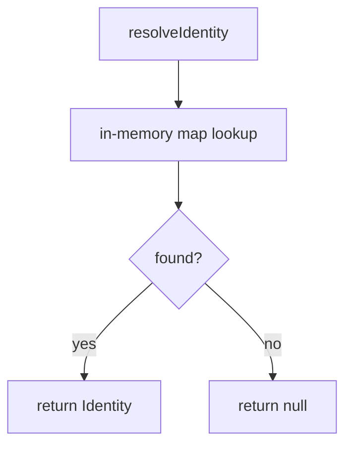

<objective>
Deliver a minimal end-to-end tracer for the identity slice.

Purpose: prove the identity mechanism works before hardening it in plan 01-02.
Output: `src/identity/slice.ts` runs and resolves a synthetic identity end to end.
</objective>

<context>
@.planning/ROADMAP.md
@.planning/phases/01-identity-slice/01-CONTEXT.md
</context>

<decision>
Use an in-memory map as the identity store for the tracer, deferring any real persistence to a later
milestone. Rationale:

- No real backend exists yet in this fixture project
- An in-memory map is enough to prove the mechanism end to end

Considered alternatives:
- A real database — rejected as premature for a tracer
- A file-backed store — rejected for the same reason
</decision>

<read_first>
Read these before starting:

- `src/identity/types.ts` — the type contract everything else depends on
- `src/identity/slice.ts` — the tracer implementation this plan hardens
- `.planning/phases/01-identity-slice/01-CONTEXT.md` — the identity slice decisions this plan assumes
</read_first>

<execution_context>
This plan runs after the 01-01 tracer has landed and before any real persistence layer exists.
</execution_context>

<tasks>

<task type="auto">
  <name>Task 1: Build the identity tracer</name>
  <files>src/identity/types.ts, src/identity/slice.ts</files>
  <action>
Define a minimal `Identity` type and an in-memory resolver function. Keep it small:

- A single exported `resolveIdentity(id: string): Identity | null` function
- Properties it must satisfy:
  - Returns `null` for an unknown id, never throws
  - Returns a fully-populated `Identity` for a known id

Example invocation:

```ts
import { resolveIdentity } from "./slice";
const identity = resolveIdentity("user-1");
```

A synthetic trace id from the resolver's log output, reproduced verbatim for the reader:

```text
hbrpoig8f1cbfno6b9m80o2rak1vrjnvgfygwwqc38hyf9sxmecosfogyr3xkxwnrek8pk3yr9oudocuzrenun5z3jqip98q1zxoi65fdhjk1eyy37q9ah8rvhs1k3aq6l6gt6mjxk87au5bhxtpdpff5e8ii49kq71n8mtzx272hpoevb9ooaedoecve6pr5n8i4p40mgg1w103dgdzvgpmm82i
```

The resolver's dependency shape, for reference:



A renderer-recognized diagram that deliberately fails browser parsing, preserving its source:

```mermaid
flowchart TD
    A[unterminated
```
  </action>
  <verify>node --experimental-strip-types src/identity/slice.ts resolves a known id</verify>
  <done>The tracer resolves a known identity and returns null for an unknown one.</done>
</task>

<task type="checkpoint:human-verify" gate="blocking">
  <what-built>The identity tracer — a single resolver function with no UI</what-built>
  <how-to-verify>
    This is a fixture PLAN.md and is never executed. The checkpoint type here exists only to prove the
    parser recognizes `type="checkpoint:human-verify"` and its `<what-built>`/`<how-to-verify>`/
    `<resume-signal>` tag set, per `GSD-DOMAIN.md`'s PLAN.md task structure section.
  </how-to-verify>
  <resume-signal>Type "approved" — never actually resumed, this is a fixture</resume-signal>
</task>

</tasks>

<verification>
1. `src/identity/slice.ts` exists and exports `resolveIdentity`.
</verification>

<success_criteria>
- The identity slice's full artifact spread loads cleanly.
</success_criteria>

<output>
Create `.planning/phases/01-identity-slice/01-01-SUMMARY.md` when done.
</output>
